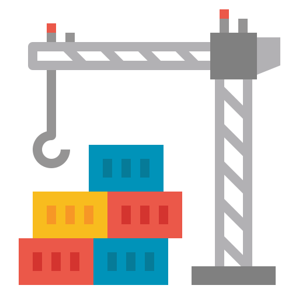

<!-- Improved compatibility of back to top link: See: https://github.com/othneildrew/Best-README-Template/pull/73 -->
<a name="readme-top"></a>


<!-- PROJECT LOGO -->
<br />
<div align="center">
  <a href="https://github.com/tr4cks/docker-netns">
    
  </a>

  <h3 align="center">docker-netns</h3>

  <p align="center">
    Docker network namespace manager
  </p>
</div>

<br />

[](https://github.com/tr4cks/docker-netns/blob/main/LICENSE)

---


<!-- TABLE OF CONTENTS -->
<details>
  <summary>Table of Contents</summary>
  <ol>
    <li><a href="#about-the-project">About The Project</a></li>
    <li>
      <a href="#getting-started">Getting Started</a>
      <ul>
        <li><a href="#prerequisites">Prerequisites</a></li>
        <li><a href="#installation">Installation</a></li>
      </ul>
    </li>
    <li>
      <a href="#usage">Usage</a>
      <ul>
        <li><a href="#shell-mode">Shell Mode</a></li>
        <li><a href="#daemon-mode">Daemon Mode</a></li>
        <li><a href="#need-help">Need Help?</a></li>
      </ul>
    </li>
    <li><a href="#license">License</a></li>
    <li><a href="#credits">Credits</a></li>
  </ol>
</details>


<!-- ABOUT THE PROJECT -->
## About The Project

This tool allows to execute commands in the network namespace of a container from the host. It can be used to execute binaries such as `ip`, `iptables`, `ebtables`...

Two modes are available:
- Shell mode: allows to test commands within a shell in the network space of a container.
- Daemon mode: allows to run commands in the background at container startup. Each command is executed within the network space of the chosen containers.

*❗️ Commands are not executed within a container but within the network namespace of a container from the host.*

*❗️ `docker-netns` only works on a Linux distribution and has only been tested on an `amd64` architecture.*


<!-- GETTING STARTED -->
## Getting Started

### Prerequisites

Start by getting the application binary either by downloading a release from GitHub or by building it using the following commands:

```shell
git clone https://github.com/tr4cks/docker-netns
cd docker-netns
go build docker-netns.go
```

### Installation

To use the tool in daemon mode, it is recommended to install the binary as shown below:

```shell
cp docker-netns /bin
chown root:root /bin/docker-netns
chmod 755 /bin/docker-netns
```

<p align="right">(<a href="#readme-top">back to top</a>)</p>


<!-- USAGE EXAMPLES -->
## Usage

### Shell Mode

This mode allows to start a new shell in which it is possible to execute commands in the same network space as a container whose ID is passed in parameter.

It can be used to check that your commands have been taken into account when you use it in daemon mode.

```shell
docker-netns shell -c 837799d65e95
```

### Daemon Mode

This mode allows to run commands in the background at the startup of some containers within their network namespace.

*How it works: daemon applies the commands to the desired containers at startup and then monitors the containers to apply the commands at their startup.*

Start by indicating in a yaml file the different commands you want to run in each container network namespace:

*Containers must be represented by their identifiers.*

```yaml
837799d65e95:
  - /usr/sbin/ip rule add fwmark 0x1 lookup 100
  - /usr/sbin/ip route add local 0.0.0.0/0 dev lo table 100 
  - /usr/sbin/iptables -t raw -A PREROUTING ! -i lo -d 127.0.0.0/8 -j DROP
  - /usr/sbin/iptables -t mangle -A POSTROUTING ! -o lo -s 127.0.0.0/8 -j DROP
  - /usr/sbin/iptables -t nat -A OUTPUT -p tcp -d 127.0.0.0/8 --tcp-flags FIN,SYN,RST,ACK SYN -j CONNMARK --set-xmark 0x01/0x0f
  - /usr/sbin/iptables -t mangle -A OUTPUT ! -o lo -p tcp -m connmark --mark 0x01/0x0f -j CONNMARK --restore-mark --mask 0x0f 

7c918b8c3e52:
  - ...
  - ...
```

Then you can install and start the daemon with the following commands:

 ```shell
 docker-netns service install --config config.yaml
 docker-netns service start
 ```

If you want to modify the configuration file afterwards, you can directly modify it in `/opt/docker-netns/config.yaml` and restart the daemon with the following command:

```shell
docker-netns service restart
```

*❗️ Old commands on already started containers will not be cancelled. Depending on your case, you may need to either delete them manually or restart the impacted containers.*

Note that you can use the daemon directly without installing it with the following command:

```shell
docker-netns --config config.yaml
```

To uninstall the daemon:

*Also deletes the configuration file.*

```shell
docker-netns service stop  # if not already stopped
docker-netns service uninstall
```

### Need Help?

For more details on all commands:

```shell
docker-netns help
```

You can also get help on each of these commands:

```shell
docker-netns service -h
```

<p align="right">(<a href="#readme-top">back to top</a>)</p>


<!-- LICENSE -->
## License

Distributed under the MIT License. See `LICENSE.txt` for more information.

<p align="right">(<a href="#readme-top">back to top</a>)</p>


<!-- CREDITS -->
## Credits

* [Container icons created by Nhor Phai - Flaticon](https://www.flaticon.com/free-icons/container)

<p align="right">(<a href="#readme-top">back to top</a>)</p>
